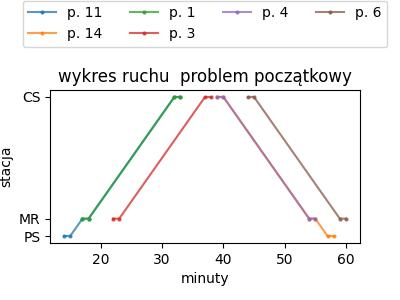
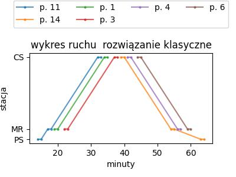
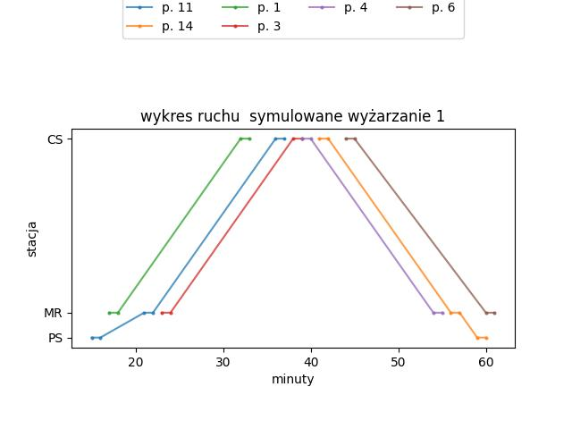
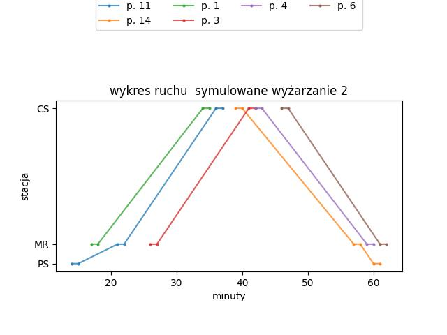

# Komputery kwantowe w planowaniu transportu: studium przypadku Baltimore

Nowoczesne komputery kwantowe, choć wciąż w fazie rozwoju i wrażliwe na szumy, otwierają zupełnie nowe możliwości w rozwiązywaniu bardzo trudnych problemów – takich, które dla klasycznych komputerów są niezwykle czasochłonne. W naszym badaniu pokazujemy, że te „szumy kwantowe” wcale nie stanowią przeszkody – mogą wręcz pomagać w znajdowaniu praktycznych rozwiązań.

Przygotowaliśmy oprogramowanie umożliwiające demonstracyjne testy problemów związanych z transportem publicznym. Do naszych eksperymentów wykorzystaliśmy symulator kwantowego wyżarzania firmy D-Wave, dzięki któremu mogliśmy generować i analizować różne scenariusze zarządzania ruchem pociągów w sytuacjach niespodziewanych zakłóceń.

Jako przykład wybraliśmy system Baltimore Light RailLink, łączący cechy tramwajów i kolei miejskiej. Naszym celem było sprawdzenie, czy technologia kwantowa może wspomagać przewidywanie i planowanie ruchu w zmiennych warunkach, w których klasyczne metody napotykają ograniczenia.

Nasze badania pokazują, że komputery kwantowe mogą stać się wartościowym narzędziem w planowaniu i optymalizacji transportu, a naturalny „szum kwantowy” może w praktyce wspierać procesy decyzyjne w złożonych, nieprzewidywalnych systemach.

**Źródło:**  
Domino, K., E. Doucet, R. Robertson, B. Gardas, i S. Deffner, “On the Baltimore Light RailLink into the quantum future”, *Scientific Reports*, vol. 15, issue 29576, 10.1038/s41598-025-15545-0


# Konfiguracja środowiska Python

Projekt wykorzystuje izolowane środowisko Pythona 3, aby zapewnić powtarzalność wyników oraz zgodność wersji bibliotek.  

Wszystkie polecenia należy wykonywać w katalogu głównym repozytorium.

---

## 1. Utworzenie środowiska wirtualnego


```bash
# Linux / macOS
python3 -m venv .venv

# Windows (PowerShell lub CMD)
python -m venv .venv
```
---

### 2. Aktywacja środowiska

```bash
# Linux / macOS
source .venv/bin/activate

# Windows PowerShell
.\.venv\Scripts\Activate.ps1

# Windows CMD
.\.venv\Scripts\activate.bat

```


---

### 3. Aktualizacja pip

```bash
# Linux / macOS
pip install --upgrade pip

# Windows
pip install --upgrade pip

```

---

### 4. Instalacja zależności

```bash
# Linux / macOS
pip install -r requirements.txt

# Windows
pip install -r requirements.txt

```

---

### 5. Dezaktywacja środowiska

```bash
# Linux / macOS
deactivate

# Windows
deactivate

```

---

### 6. Każde kolejne uruchomienie projektu

```bash
# Linux / macOS
source .venv/bin/activate

# Windows PowerShell
.\.venv\Scripts\Activate.ps1

# Windows CMD
.\.venv\Scripts\activate.bat
```


---

## Struktura projektu


Foldery:

1. `QTrains` – kod źródłowy

2. `tests` – kod testowy

3. `pics` – pliki pomocnicze dokumentacji

4. `graficzne_wyniki` – wyniki obliczeń w formie diagramów i wykresów


Pliki:

1. `computation.py` - plik główny uruchamiany do obliczeń

2. `trains_timetable.py` - plik pomocniczy zawierający aktualne studia przypadku

---

# Studium przypadku: Baltimore Light RailLink  

Baltimore Light RailLink to system kolejowo-tramwajowy w amerykańskim mieście Baltimore. W centralnej części miasta część torowiska przebiega wspólnie z ruchem ulicznym ([źródło](https://www.mta.maryland.gov/schedule/lightrail)). Ten fragment, określany jako „strefa stochastyczna”, charakteryzuje się dużą nieprzewidywalnością czasów przejazdu, ponieważ pociągi są narażone na zakłócenia spowodowane ruchem drogowym.  

Z punktu widzenia badań był to idealny obszar testowy – niepewność i trudność przewidywania opóźnień stanowią bowiem największe wyzwanie dla klasycznych algorytmów planistycznych. Schematyczną reprezentację badanego fragmentu sieci Baltimore Light RailLink przedstawiono na poniższym rysunku.  

Omówienie badań w formie popularnonaukowej, przygotowane wspólnie z partnerem amerykańskim, można znaleźć pod linkami:  
- [Quantum on track for train scheduling – UMBC](https://umbc.edu/stories/quantum-on-track-for-train-scheduling/)  
- [Film na YouTube](https://www.youtube.com/watch?v=xWKRhIeoCoA)  


## Demonstracyjne harmonogramowanie pociągów na wskazanym odcinku

W pliku `computation.py` problemy harmonogramowania pociągów są rozwiązywane przy użyciu programowania liniowego całkowitoliczbowego (ILP) oraz kwantowego (symulowanego) wyżarzania.

### Wymagania

* Do uruchomienia wymagana jest **Python 3**.

### Argumenty

* `--notrains` – liczba pociągów w problemie harmonogramowania. Dostępne wartości: `1, 2, 4, 6, 8, 10, 11, 12`.

### Przykład użycia

```bash
python3 computation.py --notrains 6
```

Po uruchomieniu wyniki (w tym wykresy ruchu) zostaną wyświetlone na ekranie, a wszystkie pliki z wynikami zostaną zapisane w katalogu ```graficzne_wyniki```.


Wykresy ruchu przedstawiają kolejno (od lewej): problem początkowy, rozwiązanie optymalne oraz dwa różne rozwiązania uzyskane metodą symulowanego wyżarzania.

<p float="left">




</p>

gdzie „p.” oznacza numery pociągów.

Należy zwrócić uwagę, że symulowane wyżarzanie zwraca wiele różnych rozwiązań, a ich spektrum stanowi dobre wejście do systemu wspomagania decyzji, w którym ostateczną decyzję podejmuje człowiek – na przykład dyżurny ruchu.


# Finansowanie

Materiał dofinansowana ze środków budżetu państwa w ramach programu Ministra Edukacji i Nauki pod nazwą
„Nauka dla Społeczeństwa II”: nr projektu NdSII/SP/0336/2024/01, kwota dofinansowania ```1 000 000``` PLN, całkowita wartość projektu ```1 000 000``` PLN
