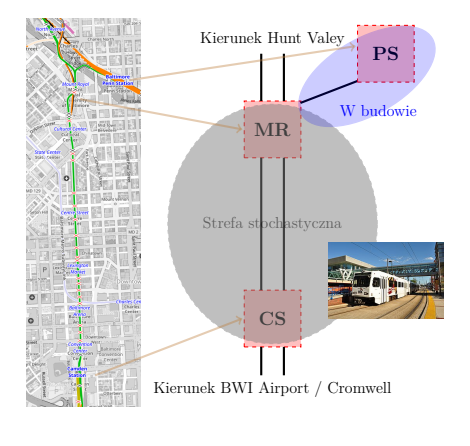

# Komputery kwantowe w planowaniu transportu: studium przypadku Baltimore

Nowoczesne komputery kwantowe, choć wciąż w fazie rozwoju i wrażliwe na szumy, otwierają zupełnie nowe możliwości w rozwiązywaniu bardzo trudnych problemów – takich, które dla klasycznych komputerów są niezwykle czasochłonne. W naszym badaniu pokazujemy, że te „szumy kwantowe” wcale nie są przeszkodą – mogą wręcz pomagać w znajdowaniu praktycznych rozwiązań.

Przygotowaliśmy oprogramowanie, które pozwala na demonstracyjne testy problemów związanych z transportem publicznym. Do naszych eksperymentów wykorzystaliśmy symulator kwantowego wyżarzania firmy D-Wave, dzięki któremu mogliśmy generować i analizować różne scenariusze zarządzania ruchem pociągów w sytuacjach, gdy pojawiają się niespodziewane zakłócenia.

Jako przykład wybraliśmy system Baltimore Light RailLink, który łączy cechy tramwajów i kolei miejskiej. Naszym celem było sprawdzenie, czy technologia kwantowa może pomóc w przewidywaniu i planowaniu ruchu w takich zmiennych warunkach, gdzie klasyczne metody mogą mieć ograniczenia.

Nasze badania pokazują, że komputery kwantowe mogą stać się pomocnym narzędziem w planowaniu i optymalizacji transportu, a naturalny „szum kwantowy” może w praktyce wspierać procesy decyzyjne w złożonych, nieprzewidywalnych systemach.

Na podstawie:
Domino, K., E. Doucet, R. Robertson, B. Gardas, i S. Deffner, “On the Baltimore Light RailLink into the quantum future”, Scientific Reports, vol. 15, issue 29576
10.1038/s41598-025-15545-0


# Konfiguracja środowiska Python

Projekt wykorzystuje izolowane środowisko Pythona 3, aby zapewnić powtarzalność wyników oraz zgodność wersji bibliotek.  

Wszystkie polecenia należy wykonywać w katalogu głównym repozytorium.

---

## 1. Utworzenie środowiska wirtualnego


```bash
# Linux / macOS
python3 -m venv .venv

# Windows (PowerShell lub CMD)
python -m venv .venv
```
---

### 2. Aktywacja środowiska

```bash
# Linux / macOS
source .venv/bin/activate

# Windows PowerShell
.\.venv\Scripts\Activate.ps1

# Windows CMD
.\.venv\Scripts\activate.bat

```


---

### 3. Aktualizacja pip

```bash
# Linux / macOS
pip install --upgrade pip

# Windows
pip install --upgrade pip

```

---

### 4. Instalacja zależności

```bash
# Linux / macOS
pip install -r requirements.txt

# Windows
pip install -r requirements.txt

```

---

### 5. Dezaktywacja środowiska

```bash
# Linux / macOS
deactivate

# Windows
deactivate

```

---

### 6. Każde kolejne uruchomienie projektu

```bash
# Linux / macOS
source .venv/bin/activate

# Windows PowerShell
.\.venv\Scripts\Activate.ps1

# Windows CMD
.\.venv\Scripts\activate.bat
```


---

## Struktura projektu


Foldery:

1. `QTrains` – kod źródłowy

2. `tests` – kod testowy

3. `pics` – pliki pomocnicze dokumentacji

4. `graficzne_wyniki` – wyniki obliczeń w formie diagramów i wykresów


Pliki:

1. `computation.py` - plik główny uruchamiany do obliczeń

2. `trains_timetable.py` - plik pomocniczy zawierający aktualne studia przypadku

---

# Studium przypadku Baltimore Light RailLink  

Jest to system kolejowo-tramwajowy w amerykańskim mieście Baltimore, w centralnej części którego część torowiska przebiega wspólnie z ruchem ulicznym https://www.mta.maryland.gov/schedule/lightrail. Ten fragment, określany jako „strefa stochastyczna”, charakteryzuje się dużą nieprzewidywalnością czasów przejazdu, ponieważ pociągi są narażone na zakłócenia spowodowane ruchem drogowym. Z punktu widzenia badań był to idealny obszar testowy – ponieważ to właśnie niepewność i trudność przewidywania opóźnień stanowią największe wyzwanie dla klasycznych algorytmów planistycznych. Schematyczną reprezentację badanego fragmentu sieci Baltimore Light RailLink przedstawiono na Rysunku poniżej, a omówienie popularnonaukowe badań przygotowanie wspólnie z partnerem amerykańskim można odnaleźć w  https://umbc.edu/stories/quantum-on-track-for-train-scheduling/  oraz https://www.youtube.com/watch?v=xWKRhIeoCoA




## Demonstracyjne harmonogramowanie pociagów na wskazanym wyżej odcinku

W `computation.py` problemy harmonogramowania pociągów są rozwiązywane za pomocą programowania liniowego całkowitoliczbowego (ILP) oraz kwantowego (symulowanego) wyżarzania.

Argumenty:

* `--notrains` – liczba pociągów w problemie harmonogramowania, możliwe: ```1,2,4,6,8,10,11,12```


Przykład użycia:

```bash
python3 computation.py --notrains 6
```

Wyniki (wykresy ruchy) zostaną wyświetlone na ekranie, a wszystkie wyniki będą znajdować się w pliku `graficzne_wyniki`:

Wykresy ruchu kolejno problem początkowy, rozwiązanie optymalne i dwa różne rozwiązania symulowanego wyżarzania


---


# Finansowanie

Materiał dofinansowana ze środków budżetu państwa w ramach programu Ministra Edukacji i Nauki pod nazwą
„Nauka dla Społeczeństwa II”: nr projektu NdSII/SP/0336/2024/01, kwota dofinansowania ```1 000 000``` PLN, całkowita wartość projektu ```1 000 000``` PLN
